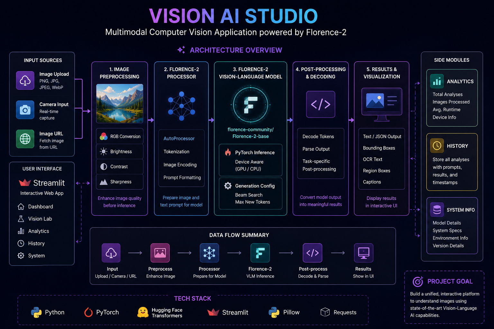

# 👁️ Vision AI Studio

### Multimodal Computer Vision & Vision-Language AI Workspace

[](https://vision-ai-02.streamlit.app/)
[](https://www.python.org/)
[](https://pytorch.org/)
[](https://huggingface.co/)
[](https://streamlit.io/)

> 🧠 **Vision AI Studio** is an interactive multimodal Computer Vision application powered by **Florence-2**, designed to perform image understanding, object detection, captioning, OCR, and region-level analysis through a unified AI workspace.

---

## 🚀 Live Demo

🌐 **Try the application live:**

**https://vision-ai-02.streamlit.app/**

No local setup is required to explore the deployed application.

---

## 📌 Overview

Vision AI Studio is a **Vision-Language Model (VLM) based Computer Vision application** built using **Microsoft Florence-2, PyTorch, Hugging Face Transformers, and Streamlit**.

Instead of building separate applications for individual computer vision tasks, this project brings multiple vision capabilities together into a single interactive workspace.

Users can provide an image through:

* 📤 Image Upload
* 📷 Camera Capture
* 🔗 Image URL

and use Florence-2 to perform different vision-language tasks from the same interface.

The project focuses on turning a powerful research-oriented vision-language model into an accessible, interactive and deployable AI application.

---

## ✨ Key Features

### 👁️ Multimodal Vision Capabilities

Vision AI Studio supports multiple Florence-2 tasks:

| # | Vision Task                    | Description                                                    |
| - | ------------------------------ | -------------------------------------------------------------- |
| 1 | 🎯 **Object Detection**        | Detects objects and identifies their locations within an image |
| 2 | 📝 **Image Captioning**        | Generates a concise description of the image                   |
| 3 | 📖 **Detailed Caption**        | Produces a more descriptive visual explanation                 |
| 4 | 📜 **More Detailed Caption**   | Generates an extended paragraph-level image description        |
| 5 | 🧩 **Dense Region Captioning** | Describes multiple regions and objects within an image         |
| 6 | 🔤 **OCR**                     | Extracts text present in an image                              |
| 7 | ⌗ **Region Proposal**          | Identifies relevant regions within an image                    |

---

## 🖼️ Multiple Image Sources

The application supports different ways of providing visual input.

### 📤 Upload

Upload supported image formats directly from your device.

Supported formats include:

* JPG
* JPEG
* PNG
* WebP

### 📷 Camera

Capture an image directly through the browser using the device camera.

### 🔗 Image URL

Provide a publicly accessible image URL and load it directly into the application.

---

## 🎨 Image Preprocessing

Vision AI Studio includes configurable image enhancement before model inference.

Available preprocessing options include:

* ☀️ **Brightness Adjustment**
* 🎚️ **Contrast Adjustment**
* ✨ **Sharpness Enhancement**
* 🖼️ **RGB Conversion**

This allows users to experiment with how different image transformations affect visual understanding and model outputs.

---

## 🧠 Florence-2 Vision Pipeline

The core of the application is the **Florence-2 Vision-Language Model**.

Florence-2 processes both the input image and the selected vision task to generate task-specific visual outputs.

### 🔄 Processing Workflow

```text
                    👤 USER
                       │
                       ▼
              ┌─────────────────┐
              │   Image Input   │
              └────────┬────────┘
                       │
          ┌────────────┼────────────┐
          ▼            ▼            ▼
      📤 Upload     📷 Camera     🔗 URL
          └────────────┼────────────┘
                       ▼
              ┌─────────────────┐
              │ Streamlit UI    │
              │   Vision Lab    │
              └────────┬────────┘
                       ▼
              ┌─────────────────┐
              │ Preprocessing   │
              ├─────────────────┤
              │ RGB Conversion  │
              │ Brightness      │
              │ Contrast        │
              │ Sharpness       │
              └────────┬────────┘
                       ▼
              ┌─────────────────┐
              │ Florence-2      │
              │   Processor     │
              └────────┬────────┘
                       ▼
              ┌─────────────────┐
              │   Florence-2    │
              │ Vision-Language │
              │     Model       │
              └────────┬────────┘
                       │
       ┌───────────────┼────────────────┐
       ▼               ▼                ▼
   🎯 Detection     📝 Caption        🔤 OCR
       │               │                │
       ├───────────────┼────────────────┤
       ▼               ▼                ▼
 🧩 Regions      📖 Detailed      ⌗ Region
   Caption          Caption         Proposal
       └───────────────┼────────────────┘
                       ▼
              ┌─────────────────┐
              │ Post Processing │
              │ & Result Parser │
              └────────┬────────┘
                       ▼
          ┌────────────┼────────────┐
          ▼            ▼            ▼
      📊 Results     🕘 History   ⚡ Runtime
          │
          ▼
       👁️ Visualization
```

---

## 🏗️ System Architecture

The complete architecture of the application is available below:



### Architecture Components

**1. Input Layer**

Users can provide images through upload, camera capture, or URL.

**2. Streamlit Application Layer**

The Streamlit interface handles user interaction, task selection, preprocessing controls and result visualization.

**3. Preprocessing Layer**

Images are converted and optionally enhanced before being passed to the model.

**4. Model Processing Layer**

The Florence-2 processor prepares the image and task prompt for model inference.

**5. Vision-Language Model**

Florence-2 performs the selected multimodal vision task using PyTorch.

**6. Task Processing Layer**

Generated outputs are parsed and transformed into user-readable results.

**7. Analytics & History Layer**

Inference runtime and previous analyses can be tracked through the application interface.

---

## 🔬 Vision Lab

The **Vision Lab** is the primary workspace of the application.

A typical analysis follows these steps:

```text
1. Select Image Source
        ↓
2. Load Image
        ↓
3. Preview Image
        ↓
4. Select Vision Task
        ↓
5. Configure Preprocessing
        ↓
6. Run Florence-2
        ↓
7. Process Model Output
        ↓
8. Display Results
        ↓
9. Track Runtime
        ↓
10. Store Analysis
```

---

## 📊 Analytics

Vision AI Studio includes runtime and usage analytics to make model experimentation easier.

The application can track information such as:

* 🔢 Total analyses
* 🖼️ Images processed
* ⏱️ Inference runtime
* ⚡ Current inference device
* 📈 Analysis activity

These metrics provide visibility into the model's runtime behavior during experimentation.

---

## 🕘 Analysis History

Previous analyses can be accessed through the History section.

History can contain information such as:

* 🧠 Selected vision task
* 🔤 Model prompt
* 📄 Generated result
* ⏱️ Inference runtime
* 📅 Analysis timestamp

Users can also clear the stored analysis history.

---

## ⚡ Model Inference & Performance

The application uses PyTorch-based inference optimizations to reduce unnecessary computation during prediction.

Key techniques include:

* `torch.no_grad()` for inference
* ⚡ Device-aware tensor processing
* 🔎 Beam-search based generation
* ⏱️ Runtime measurement
* 💾 Cached model loading
* 🖥️ CPU/CUDA device detection

The application can detect whether CUDA is available and use the available inference device.

---

## 🛠️ Technology Stack

### 🤖 AI / Machine Learning

* **Florence-2**
* **Vision-Language Models**
* **Computer Vision**
* **PyTorch**
* **Hugging Face Transformers**

### 🐍 Backend / Application

* **Python**
* **Streamlit**
* **Pillow**
* **Requests**

### 🔧 Development Tools

* **VS Code**
* **Git**
* **GitHub**
* **Virtual Environment**

### ☁️ Deployment

* **Streamlit Community Cloud**

---

## 📂 Project Structure

```text
Vision-AI/
│
├── app.py
│   └── Main Streamlit application
│
├── requirements.txt
│   └── Python dependencies
│
├── assets/
│   └── architecture.png
│       └── System architecture diagram
│
├── README.md
│   └── Project documentation
│
└── .gitignore
    └── Ignored files and folders
```

---

## 💻 Installation & Setup

### 1️⃣ Clone the Repository

```bash
git clone https://github.com/YOUR_USERNAME/YOUR_REPOSITORY.git
```

```bash
cd YOUR_REPOSITORY
```

---

### 2️⃣ Create a Virtual Environment

#### Windows

```bash
python -m venv .venv
```

#### macOS / Linux

```bash
python3 -m venv .venv
```

---

### 3️⃣ Activate the Environment

#### Windows

```powershell
.venv\Scripts\activate
```

#### macOS / Linux

```bash
source .venv/bin/activate
```

---

### 4️⃣ Install Dependencies

```bash
pip install -r requirements.txt
```

---

### 5️⃣ Run the Application

```bash
streamlit run app.py
```

The application will open locally at:

```text
http://localhost:8501
```

---

## 📦 Core Dependencies

The application is built around the following packages:

```text
streamlit
torch
transformers
Pillow
requests
```

For reproducibility, it is recommended to use the versions specified in `requirements.txt`.

---

## 🎯 Use Cases

Vision AI Studio can be useful for:

### 🔍 Image Understanding

Analyze and describe the contents of images using a Vision-Language Model.

### 🎯 Object Detection

Identify objects and their corresponding regions within images.

### 📝 Automated Image Description

Generate natural-language descriptions of visual content.

### 🔤 OCR

Extract visible text from images.

### 🧩 Region-Level Understanding

Analyze specific regions and objects within complex scenes.

### 🧪 VLM Experimentation

Experiment with different Florence-2 capabilities from one unified interface.

### 🎓 Learning & Research

Explore practical applications of Vision-Language Models and multimodal AI.

### 🚀 AI Portfolio Demonstration

Demonstrates how a pretrained multimodal model can be integrated into a real-world interactive application and deployed online.

---

## 🧠 What This Project Demonstrates

This project showcases practical experience with:

* 👁️ Computer Vision
* 🧠 Vision-Language Models
* 🤖 Multimodal AI
* 🔥 PyTorch
* 🤗 Hugging Face Transformers
* 📝 Image Captioning
* 🎯 Object Detection
* 🔤 OCR
* 🧩 Region-Based Vision
* 🖼️ Image Preprocessing
* ⚡ Model Inference Optimization
* 📊 Runtime Analytics
* 🎈 Streamlit Application Development
* ☁️ AI Application Deployment

---

## 🔮 Future Improvements

The architecture can be extended with additional multimodal capabilities.

Potential future improvements include:

* 💬 Conversational image analysis
* ❓ Visual Question Answering
* 🧠 Multi-model support
* 📄 Document understanding
* 📑 PDF analysis
* 📦 Batch image processing
* 🎥 Video understanding
* 🔎 Advanced detection visualization
* 🌐 REST API integration
* ⚡ GPU-backed inference
* 📊 Advanced performance analytics
* 💾 Persistent database-backed history
* 👤 Authentication and user profiles
* 🔌 Integration with external AI applications

---

## 🌍 Deployment

Vision AI Studio is deployed as a live Streamlit application.

### ☁️ Deployment Platform

**Streamlit Community Cloud**

### 🚀 Live Application

https://vision-ai-02.streamlit.app/

The application can be accessed directly through a browser without requiring users to install the project locally.

---

## 🔐 Deployment Considerations

For production-oriented deployment, additional improvements can include:

* Environment-specific configuration
* Dependency version pinning
* Persistent storage
* GPU-backed inference
* Application monitoring
* Error logging
* Request-level performance monitoring
* Rate limiting
* Authentication

---

## 🧪 Example Workflow

Suppose a user uploads an image containing several objects and some visible text.

The workflow would be:

```text
📤 Upload Image
       ↓
🖼️ Preview
       ↓
✨ Optional Image Enhancement
       ↓
🎯 Select Object Detection
       ↓
🧠 Florence-2 Inference
       ↓
📍 Detected Regions
       ↓
📊 Display Results
       ↓
⏱️ Record Runtime
       ↓
🕘 Save Analysis
```

The same image can then be analyzed using OCR, captioning, dense-region captioning or other supported tasks.

---

## 📈 Why Florence-2?

Florence-2 provides a unified approach to multiple vision-language tasks.

Instead of maintaining separate models for every capability, the project uses a single multimodal model architecture to support several different forms of image understanding.

This makes the application:

* 🧩 Modular
* 🔄 Extensible
* 🧠 Multimodal
* 🚀 Practical for experimentation
* 🎯 Easy to expand with additional vision tasks

---

## 🤝 Contributing

Contributions and improvements are welcome.

### Fork the repository

```bash
git fork
```

### Create a feature branch

```bash
git checkout -b feature/new-feature
```

### Commit your changes

```bash
git add .
git commit -m "Add new vision capability"
```

### Push your branch

```bash
git push origin feature/new-feature
```

Then open a Pull Request 🚀

---

## ⭐ Support

If you find this project useful:

⭐ Star the repository
🍴 Fork the project
🐛 Report bugs
💡 Suggest improvements
🔀 Submit pull requests

Every contribution helps improve the project!

---

## 📜 License

This project is intended for educational, research, experimentation and portfolio purposes.

The project uses third-party libraries and pretrained models. Please refer to the respective licenses and usage terms of the underlying technologies before using the application commercially.

---

## 👨‍💻 Project

### Vision AI Studio

**Multimodal Computer Vision powered by Florence-2**

Built with:

`Python` • `PyTorch` • `Florence-2` • `Hugging Face Transformers` • `Streamlit`

---

## 🚀 Final Note

Vision AI Studio demonstrates how a pretrained **Vision-Language Model** can be transformed into an interactive, user-facing AI application.

From image ingestion and preprocessing to multimodal inference, result generation, analytics and deployment, the project brings the complete workflow together in one application.

> **👁️ Turning images into actionable visual intelligence with multimodal AI.**

---

### 🌐 Live Demo

**https://vision-ai-02.streamlit.app/**
